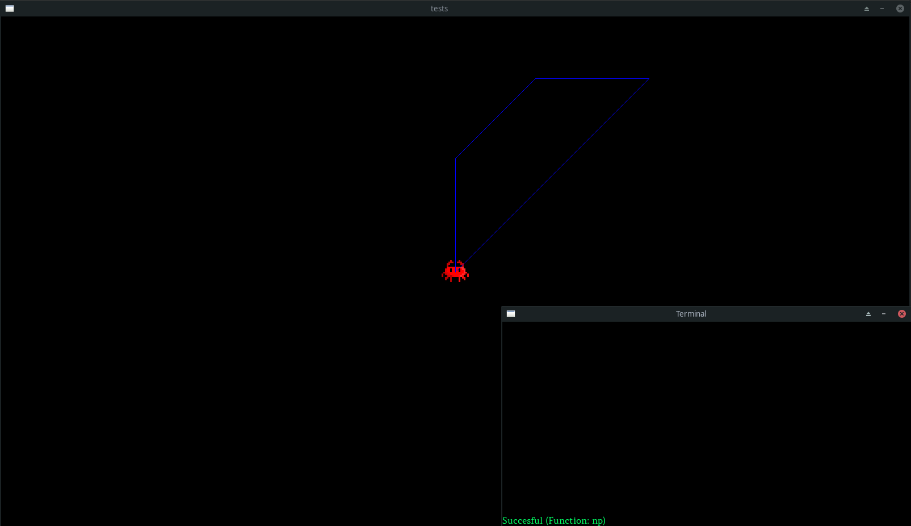

# LogoLike



---

LogoLike is C project for educational purpose, inspired by Logo language.
This repository is heart of whole LogoLike. Code needs generated project folder to display canvas. 


If you are searching for graphical integrated canvas maker (that can initalize and edit canvas) for LogoLike, you may want to see [LogoLike-GUI](https://github.com/sqbi-q/LogoLike-GUI).

---

## What is Logo?

Logo is an educational programming language, designed in 1967 by Wally Feurzeig, Seymour Papert, and Cynthia Solomon. Logo is widely known for its use of turtle graphics, in which commands for movement and drawing produced line or vector graphics, either on screen or with a small robot termed a turtle.


---
# Installation

First, [clone](https://git-scm.com/book/en/v2/Git-Basics-Getting-a-Git-Repository) this project using [git-clone](https://git-scm.com/docs/git-clone):

```bash
git clone https://github.com/sqbi-q/LogoLike.git --recurse-submodules --remote-submodules
```
Using `--recurse-submodules` and `--remote-submodules` clones submodules [jsmn](https://github.com/zserge/jsmn) and [map](https://github.com/rxi/map) that are required by code.
Then when you already have project on disk, you need to compile it.

---

# Compilation

## Windows
First, to compile program you need to have installed C (or C++) compiler.

[Mingw-w64](http://mingw-w64.org/doku.php) is common option for Windows.
Mingw-w64 instalator: https://sourceforge.net/projects/mingw-w64/
(Tutorial: https://code.visualstudio.com/docs/languages/cpp#_example-install-mingwx64)
(You should also add Mingw-w64 to Windows PATH environment variable: https://code.visualstudio.com/docs/languages/cpp#_add-the-mingw-compiler-to-your-path)

Project needs to have installed:
	SDL2 - for graphics;
	SDL_ttf 2.0 - for font;

Download SDL2 Development Libraries for Windows, for MinGW from: https://www.libsdl.org/download-2.0.php
After you download you should unzip folder to `COMPILE` dictionary and rename it to "SDL2"

Download SDL_ttf Development Libraries for Windows, for MinGW from: https://www.libsdl.org/projects/SDL_ttf/
After you download you should unzip folder to `COMPILE` dictionary and rename it to "SDL2_ttf"

To compile program, you should run batch file `compile_windows.bat` in `COMPILE` folder.


## Linux

Project need SDL2 (for graphics) and SDL2_ttf (for font) to compile. 
Compile project using `make` in `./LogoLike/COMPILE` or by running `./LogoLike/COMPILE/compile_gcc.sh` 

---

## Usage

Raw LogoLike needs initalized project folder to run.
Project folder and `setting.json` are files generated by [LogoLike-gui](https://github.com/sqbi-q/LogoLike-GUI) - graphical environment written in Java, allowing building canvas of LogoLike. 

This script should be executed by LogoLike-GUI.
```bash
./LogoLike_output <RELATIVE_PATH_TO_SETTING.JSON>
``` 
Besides running compiled LogoLike code, it is passing relative path to `setting.json` inside project folder.

## License
[GNU GPLv3](https://choosealicense.com/licenses/gpl-3.0/)
